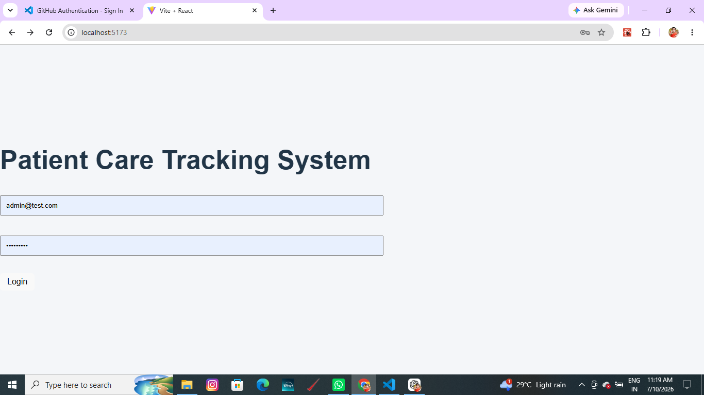
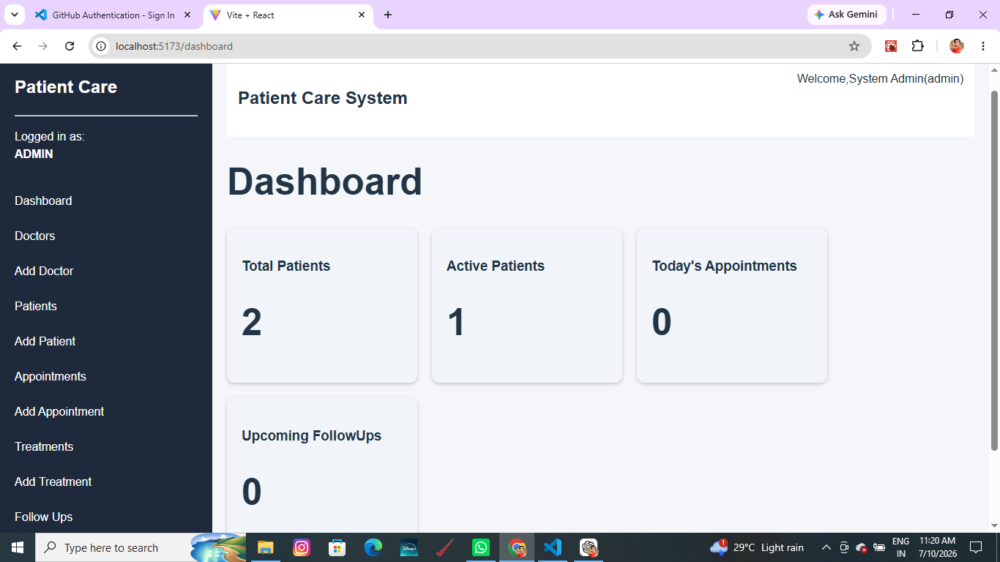
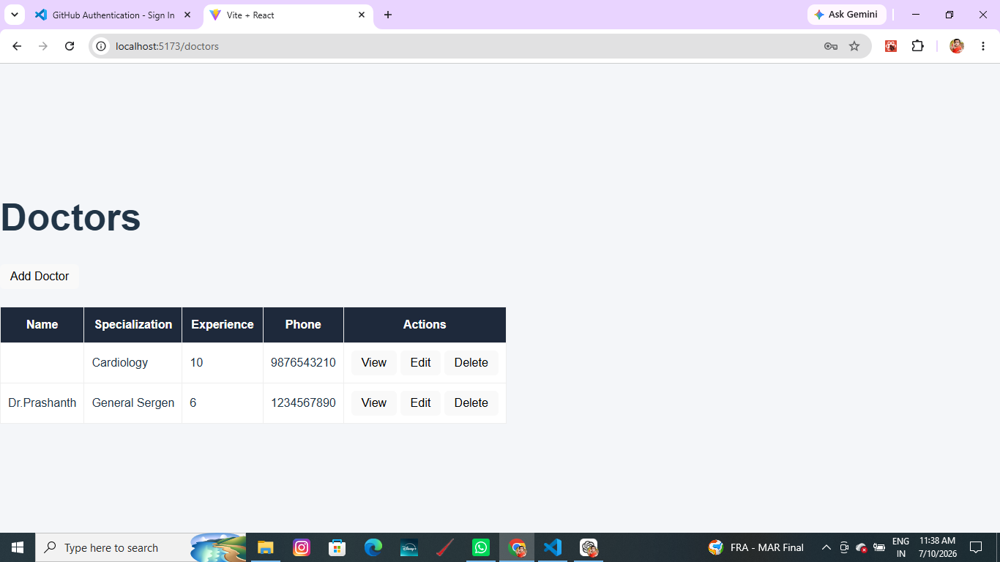
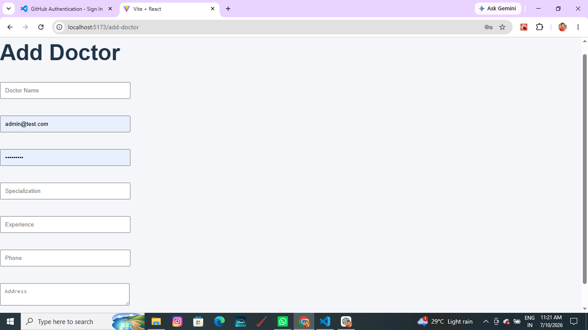
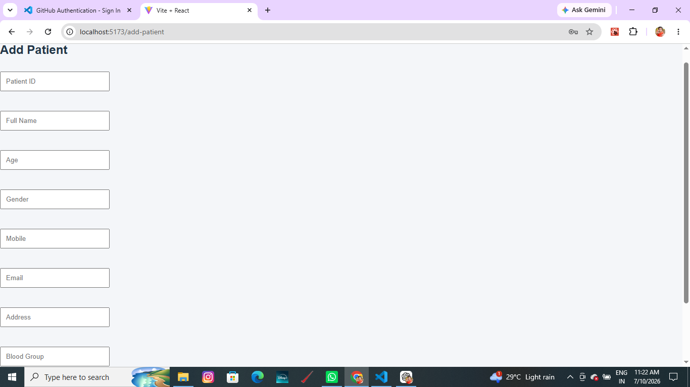
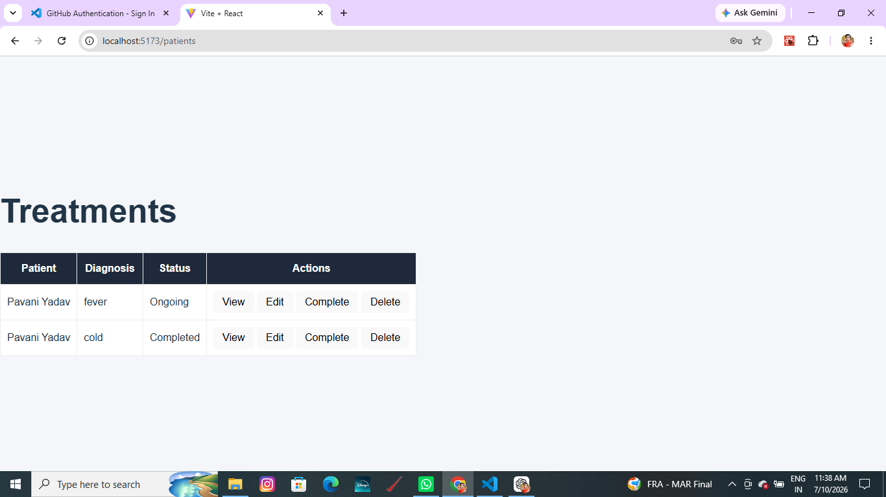
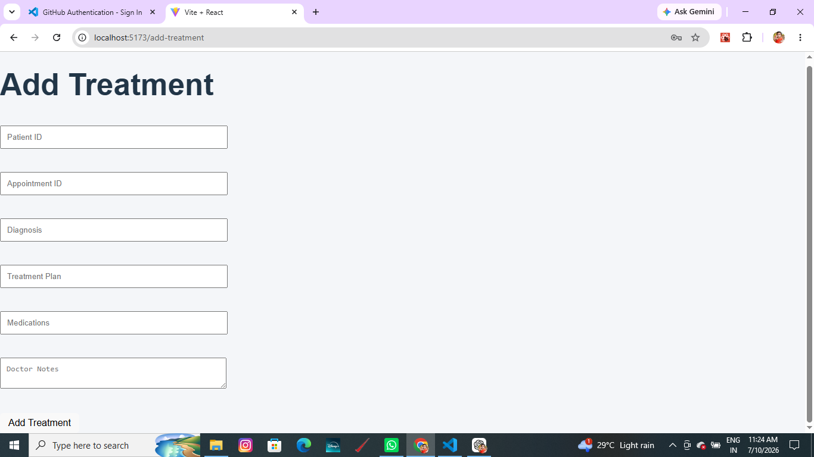
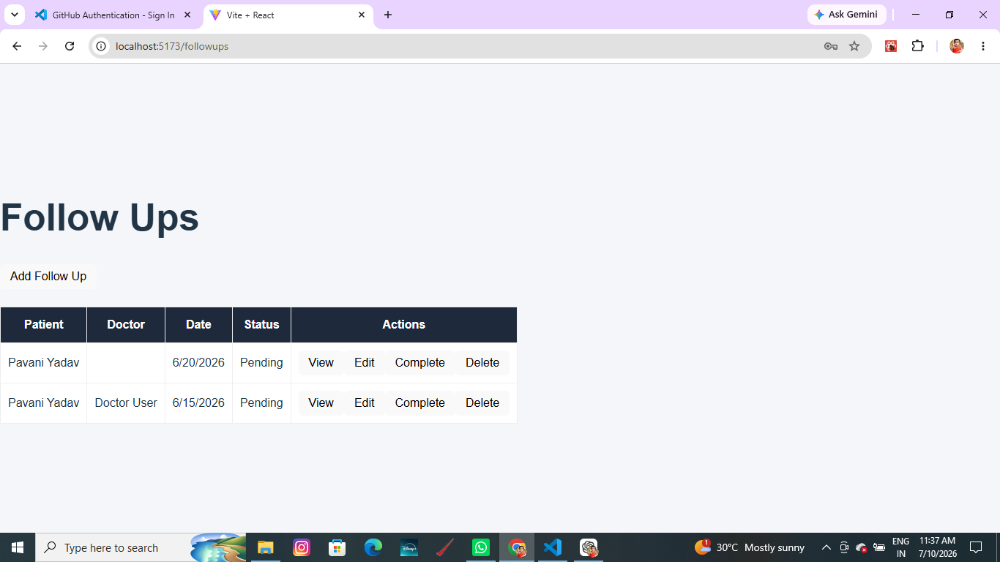

# 🏥 Patient Care Tracking System

A full-stack web application developed to help hospitals and clinics efficiently manage patient information, doctors, treatments, and follow-up appointments. The system provides a secure and user-friendly interface for healthcare management.

---

## 📌 Project Overview

The Patient Care Tracking System is designed to simplify healthcare management by allowing administrators to maintain patient records, doctor details, treatment history, and follow-up schedules in one centralized application.

This project demonstrates full-stack web development skills using the MERN Stack.

---

## ✨ Features

### Authentication
- Secure Login
- JWT Authentication
- Protected Routes

### Dashboard
- Admin Dashboard
- Quick navigation
- Overview of hospital management

### Patient Management
- Add Patient
- View Patients
- Update Patient Details
- Delete Patient

### Doctor Management
- Add Doctor
- View Doctors
- Update Doctor Details
- Delete Doctor

### Treatment Management
- Add Treatment
- View Treatments
- Update Treatment Details
- Delete Treatment

### Follow-up Management
- Schedule Follow-ups
- Track Patient Follow-ups
- Update Follow-up Status

---

# 🛠️ Tech Stack

## Frontend

- React.js
- React Router DOM
- Axios
- CSS

## Backend

- Node.js
- Express.js

## Database

- MongoDB Atlas
- Mongoose

## Authentication

- JSON Web Token (JWT)

## Tools

- Visual Studio Code
- Postman
- Git
- GitHub

---

# 📂 Project Structure

```
patient-care-tracking-system
│
├── backend
│   ├── config
│   ├── controllers
│   ├── middleware
│   ├── models
│   ├── routes
│   ├── server.js
│   └── package.json
│
├── frontend
│   ├── src
│   ├── public
│   ├── package.json
│   └── vite.config.js
│
├── screenshots
│
└── README.md
```

---

# 📸 Project Screenshots

## Login Page



---

## Dashboard



---

## Doctors Page



---

## Add Doctor



---

## Add Patient



---

## Treatments



---

## Add Treatment



---

## Follow-ups



---

# ⚙️ Installation

## Clone Repository

```bash
git clone https://github.com/1pavani/patient-care-tracking-system.git
```

Go to project folder

```bash
cd patient-care-tracking-system
```

---

## Backend Setup

```bash
cd backend
```

Install dependencies

```bash
npm install
```

Create a `.env` file

```
PORT=5000

MONGO_URI=Your_MongoDB_Connection_String

JWT_SECRET=your_secret_key
```

Run backend

```bash
npm start
```

or

```bash
node server.js
```

---

## Frontend Setup

Open another terminal

```bash
cd frontend
```

Install dependencies

```bash
npm install
```

Run project

```bash
npm run dev
```

---

# 🌐 API Modules

- Authentication
- Patients
- Doctors
- Treatments
- Follow-ups

---

# 🔒 Security Features

- JWT Authentication
- Protected Routes
- Password Validation
- MongoDB Data Storage
- REST API Architecture

---

# 📈 Future Enhancements

- Appointment Booking
- Doctor Availability
- Email Notifications
- SMS Alerts
- Medical Report Upload
- Prescription Management
- Role-Based Access Control
- Search & Filter Functionality
- Analytics Dashboard

---

# 🎯 Learning Outcomes

Through this project, I gained practical experience in:

- Full Stack Web Development
- React.js
- Node.js
- Express.js
- MongoDB
- REST APIs
- JWT Authentication
- CRUD Operations
- Routing
- State Management
- API Integration
- Git & GitHub

---

# 👩‍💻 Author

**Pavani Rajaboina**

GitHub

https://github.com/1pavani

LinkedIn

https://www.linkedin.com/in/pavani-rajaboina-019341263/

---

# ⭐ Support

If you found this project helpful, please consider giving it a ⭐ on GitHub.

Thank you for visiting this repository!
